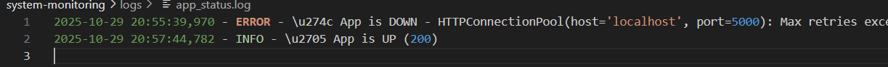
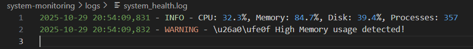

# 🐮 Wisecow – Kubernetes Deployment Project  

This project is part of my **Accuknox DevOps Trainee Practical Assessment**.  
It demonstrates the **containerization and deployment** of the **Wisecow** web application on a **Kubernetes cluster**, with **CI/CD automation using GitHub Actions**, and an optional **TLS setup** for secure communication.  

---

## 🧩 Problem Statement 1 – Wisecow Deployment  

Deploy the **Wisecow** application as a **Kubernetes app** with containerization, CI/CD automation, and secure communication.  

### ✅ Requirements  
- Create a **Dockerfile** for the Wisecow application.  
- Write **Kubernetes manifests** to deploy it in a cluster.  
- Expose the Wisecow service via a **Kubernetes Service**.  
- Configure **GitHub Actions** for automatic Docker image build and push.  
- *(Optional Challenge Goal)* Enable **TLS** for secure HTTPS communication.  

---

## ⚙️ Prerequisites  

Before you begin, ensure the following tools and dependencies are installed:  

- **Docker**  
- **kubectl**  
- **Minikube** (or Kind / any Kubernetes cluster)  
- **Git**  
- **fortune-mod** and **cowsay** packages  

## 📸 Output Preview  

  
---
## 🧠 Additional Scripts – Problem Statement 2

In addition to Wisecow, this repository also includes Problem Statement 2, located in:

system-monitoring/

This contains scripts for System Health Monitoring that perform the following tasks:

- **Monitor CPU usage**
- **Track Memory utilization**
- **Check Disk space availability**
- **List Running processes**
- **Trigger alerts when thresholds are exceeded**
- **Output-system_health.log**
  

 **Output-app_status.log**
   
---
## 🧰 KubeArmor Policy (Zero Trust)

A Zero-Trust KubeArmor Policy was written to enhance workload security for the Wisecow app.
It restricts access to sensitive system files.

⚠️ Note:
During testing, due to local system configuration, I encountered issues enforcing the block access rule in KubeArmor.
All other configurations and policies were successfully applied.