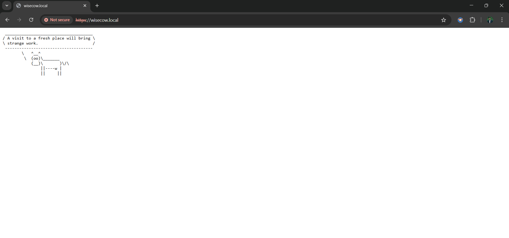

# 🐮 Wisecow – Kubernetes Deployment Project  

This project is part of my **Accuknox DevOps Trainee Practical Assessment**.  
It demonstrates the **containerization and deployment** of the **Wisecow** web application on a **Kubernetes cluster**, with **CI/CD automation using GitHub Actions**, and an optional **TLS setup** for secure communication.  

---

## 📸 Output Preview  

Below is the screenshot of the successfully running Wisecow application deployed on Kubernetes:  

  

---

## 🧩 Problem Statement 1 – Wisecow Deployment  

Deploy the **Wisecow** application as a **Kubernetes app** with containerization, CI/CD automation, and secure communication.  

### ✅ Requirements  
- Create a **Dockerfile** for the Wisecow application.  
- Write **Kubernetes manifests** to deploy it in a cluster.  
- Expose the Wisecow service via a **Kubernetes Service**.  
- Configure **GitHub Actions** for automatic Docker image build and push.  
- *(Optional Challenge Goal)* Enable **TLS** for secure HTTPS communication.  

---

## ⚙️ Prerequisites  

Before you begin, ensure the following tools and dependencies are installed:  

- **Docker**  
- **kubectl**  
- **Minikube** (or Kind / any Kubernetes cluster)  
- **Git**  
- **fortune-mod** and **cowsay** packages  

Install required packages:  
```bash
sudo apt update
sudo apt install fortune-mod cowsay -y

🚀 Deployment Steps

Follow these steps to deploy the Wisecow application on Kubernetes:

Clone the repository

git clone <your-repo-url>
cd wisecow


Build the Docker image

docker build -t wisecow:latest .


Start Minikube

minikube start


Apply Kubernetes manifests

kubectl apply -f k8s/deployment.yaml
kubectl apply -f k8s/service.yaml


Check pod and service status

kubectl get pods
kubectl get svc


Access the application

minikube service wisecow-service

🔒 TLS Configuration (Optional)

To enable TLS for secure communication:

Certificates are stored in the k8s/ directory as:

wisecow.crt

wisecow.key

privkey.pem

These certificates are referenced in the Ingress configuration file:

k8s/ingress.yaml


This setup ensures HTTPS access to the Wisecow application.

⚙️ GitHub Actions (CI/CD)

GitHub Actions is configured in:

.github/workflows/ci-cd.yml


This workflow:

Automatically builds and pushes Docker images to Docker Hub when new commits are pushed.

Ensures version consistency and automates deployment pipelines.

🧠 Additional Scripts – Problem Statement 2

In addition to Wisecow, this repository also includes Problem Statement 2, located in:

system-monitoring/


This contains scripts for System Health Monitoring that perform the following tasks:

Monitor CPU usage

Track Memory utilization

Check Disk space availability

List Running processes

Trigger alerts when thresholds are exceeded

Directory Structure:
system-monitoring/
├── logs/
├── scripts/
├── LICENSE (optional)
└── requirements.txt

🧰 KubeArmor Policy (Zero Trust)

A Zero-Trust KubeArmor Policy was written to enhance workload security for the Wisecow app.
It restricts access to sensitive system files.

⚠️ Note:
During testing, due to local system configuration, I encountered issues enforcing the block access rule in KubeArmor.
All other configurations and policies were successfully applied.

🏁 Summary

✅ Containerized the Wisecow web app using Docker
✅ Deployed it on Kubernetes using YAML manifests
✅ Configured CI/CD with GitHub Actions
✅ Enabled optional TLS for secure communication
✅ Added System Monitoring scripts for health tracking
✅ Attempted Zero-Trust KubeArmor policy for workload security